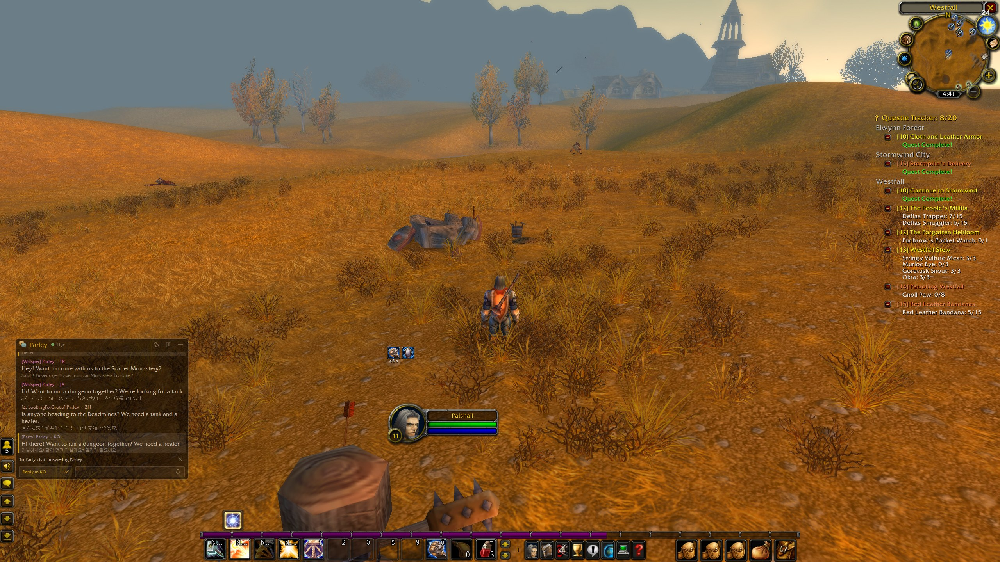
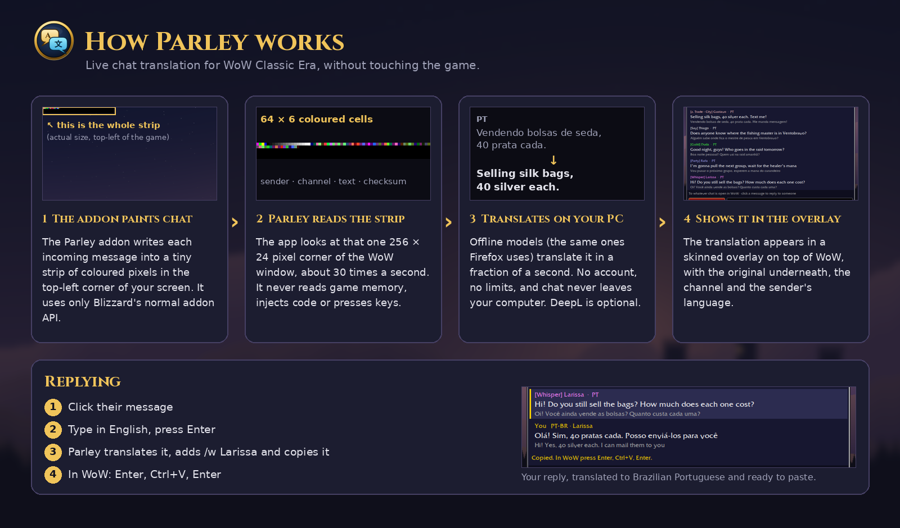
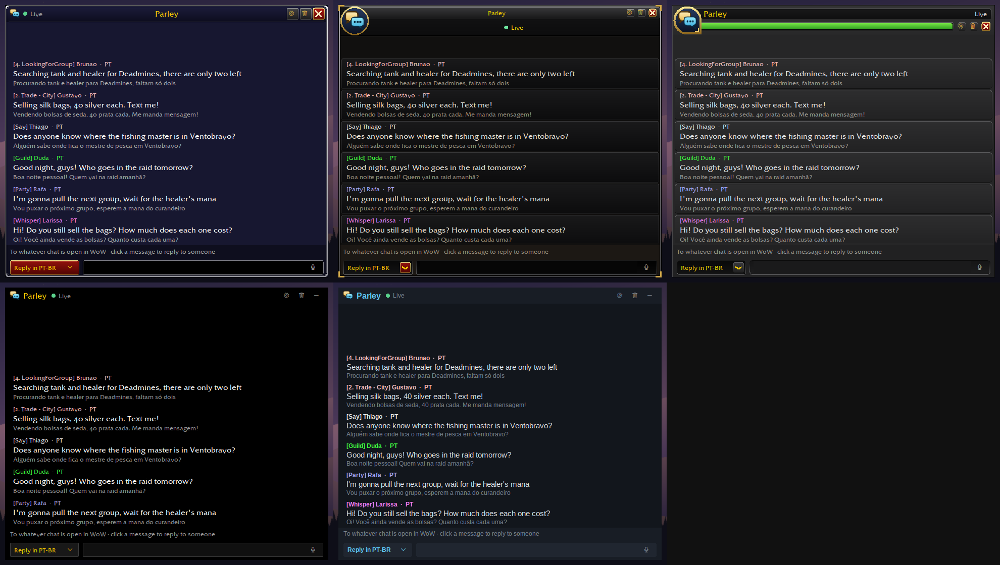

# Parley

**Live chat translation for World of Warcraft Classic Era**, with beta support for Anniversary realms, Mists of Pandaria Classic and Retail.

Players from Brazil, Russia, Spain, Germany and everywhere else share realms. Parley translates their chat into your language as it arrives, and translates your replies back into theirs. Type or speak your reply; Parley copies it, ready to paste.

> Parley is a fan project. It is not made, endorsed or supported by Blizzard Entertainment.

## Features

- **No account needed**: Parley translates **offline, on your PC**, with the same open translation models Firefox uses. Nothing to sign up for, no limits, and chat never leaves your computer. Each language downloads once (about 50 MB) the first time someone uses it.
- **Real sentences, not just phrases**: 30+ languages including Spanish, Portuguese, Russian, German, French, Italian, Polish, Chinese, Japanese and Korean, in both directions. Languages without a direct model are translated through English.
- **Optional online engines**: paste a **DeepL** key for the best quality, or an **Azure Translator** key (2 million characters a month free). If either is unreachable or out of characters, Parley falls back to offline automatically.
- **Only what you need**: English chat is filtered out for free. An in-game settings window (`/parley` or the minimap button) has one-click presets like *Friends & group* or *Group only*, per-chat-type switches, and your own saved presets.
- **Reply in their language**: click a message, type in English, press Enter. Parley translates it, adds the right chat command (`/w Name`, `/p`, `/4` …) and copies it. You paste it into WoW yourself.
- **Quick replies**: one click for *Invite me, please*, *Thanks for the group!*, *One moment* and more, already translated into nine languages.
- **Alerts**: messages that mention your character or words you pick (*Deadmines*, *WTB*, *healer*) are highlighted with a soft sound.
- **Auto-hide**: the overlay can fade away when chat is quiet and come back the moment someone writes.
- **Handy extras**: right-click a message to copy it, reply, or mute a spammer; a click-through mode so the overlay never catches a stray click; a daily chat-history file, and one-click updates when a new version is out.
- **Voice replies**: press Ctrl+Shift+Y and talk. Speech is transcribed on your own PC (whisper.cpp), with no popup and no online speech service.
- **Knows gamer talk**: WoW terms (tank, LFG, WTS, dungeon abbreviations) stay in English, chat shortcuts (sry, w8, idk…) and Brazilian shorthand (vc, blz, kkkk…) are spelled out for the translator, and an optional "Terms" line explains WoW jargon in your language. The slang dictionary comes from the MIT-licensed BabelChat and WoW Translator projects.
- **In your language**: the app, installer and addon follow your Windows and WoW language (German, Spanish, French, Italian, Portuguese, Russian, Korean, Chinese), and chat is translated into your language out of the box.
- **Other WoW versions (beta)**: the addon also loads on the Anniversary realms, Mists of Pandaria Classic and Retail, and Parley installs it into each one it finds. These haven't had much testing yet, so please [report anything odd](../../issues). One catch on Retail: during Mythic+ keys, PvP matches and boss fights Blizzard hides chat from all addons, so Parley pauses there and says so in the overlay. It picks up again as soon as they end.
- **Skins**: Classic WoW, Retail WoW, Dragonflight UI, WoW chat frame and a modern dark theme.
- **Safe by design**: the addon uses only Blizzard's standard addon API. The desktop app never reads game memory, injects code or presses keys.

## Skins

Pick a look under Settings → Skin. Menus, dropdowns and the settings window follow the skin too.

## How it works (short version)

WoW addons can't access the internet, so Parley comes in two parts:

1. **The Parley addon** shows each chat message for a split second as a tiny strip of coloured squares in the top-left corner of the game window.
2. **The Parley app** (a small Windows tray program) reads that strip from the screen, turns it back into the exact text, translates it and shows it in an overlay next to your game.

The full explanation is in [docs/HOW_IT_WORKS.md](docs/HOW_IT_WORKS.md).

## Requirements

- Windows 10 or 11 (64-bit)
- World of Warcraft **Classic Era** (or, in beta, **Anniversary**, **Mists of Pandaria Classic** or **Retail**) in **Windowed (Fullscreen)** display mode. Parley installs the addon into each one it finds
- That's it. A DeepL API key is optional.

## Performance & what it reads

- **It doesn't record your screen.** The app reads one 256 × 24 pixel patch at the top-left of the WoW window about 28 times a second, decodes it in memory, and keeps nothing. It never touches WoW's memory, files or keyboard.
- **Screen reading** is a tiny copy each time; the app is idle in between.
- **Offline translation** runs at below-normal priority and only when a foreign message arrives; it uses no CPU the rest of the time. Speed and memory figures are in [How it works](docs/HOW_IT_WORKS.md#performance).
- **Any resolution**: the addon sizes the strip in physical pixels, so 720p, 1080p, 1440p, 4K and ultrawide all work, with any UI scale or Windows display scaling.

## Install

Run **`Parley-Setup.exe`** from the [Releases](../../releases) page. It installs the app, puts the addon into your WoW folder, and adds shortcuts. Step-by-step instructions, including installing the addon by hand, are in **[INSTALL.txt](INSTALL.txt)**.

## Documentation

| | |
|---|---|
| [INSTALL.txt](INSTALL.txt) | Step-by-step installation |
| [docs/USER_GUIDE.md](docs/USER_GUIDE.md) | Using Parley: replies, voice, skins, commands, troubleshooting |
| [docs/HOW_IT_WORKS.md](docs/HOW_IT_WORKS.md) | Architecture and the pixel-strip protocol |
| [docs/BUILDING.md](docs/BUILDING.md) | Building from source, and the repository layout |
| [PRIVACY.md](PRIVACY.md) | What data goes where |
| [CHANGELOG.md](CHANGELOG.md) | Version history |
| [THIRD_PARTY_NOTICES.md](THIRD_PARTY_NOTICES.md) | Credits and licenses of included components |

## Is this allowed?

The addon follows Blizzard's UI Add-On Development Policy: it's free, its code is open, it contains no ads, and it only uses the normal addon API. The desktop app works like a screen-capture or stream overlay tool. It only reads a few pixels off the screen and never touches the game process. Blizzard has not reviewed or approved Parley, though, and third-party programs are always used at your own risk. See the "Is this safe?" section of the [User Guide](docs/USER_GUIDE.md#is-this-safe).

## License

Parley is released under the [MIT License](LICENSE). World of Warcraft and Blizzard Entertainment are trademarks or registered trademarks of Blizzard Entertainment, Inc.
